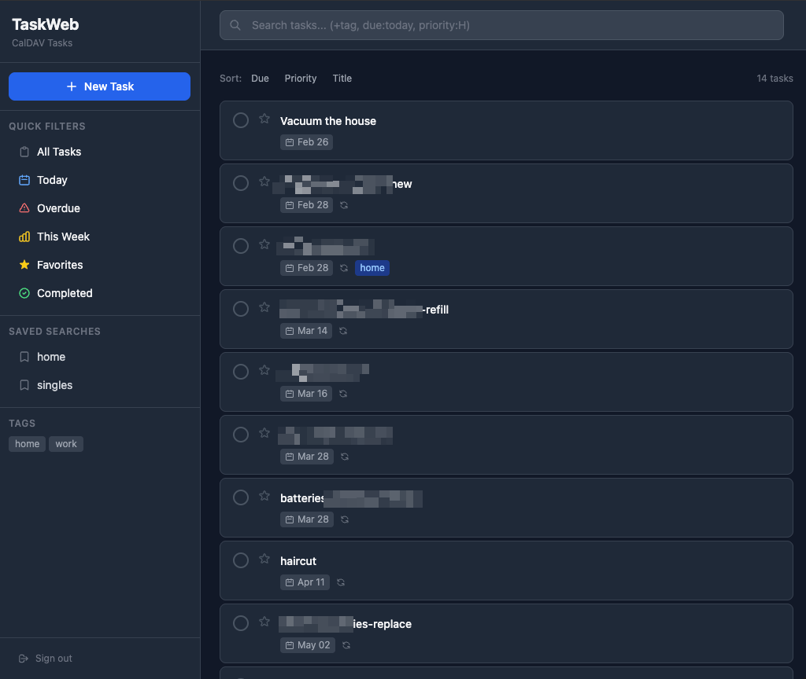
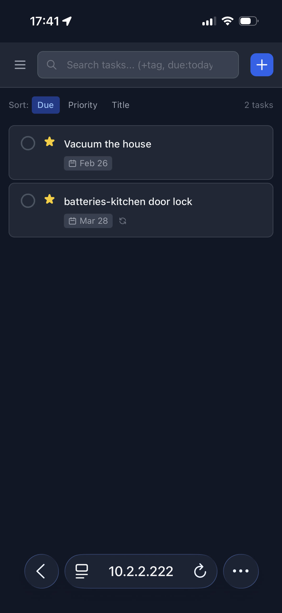
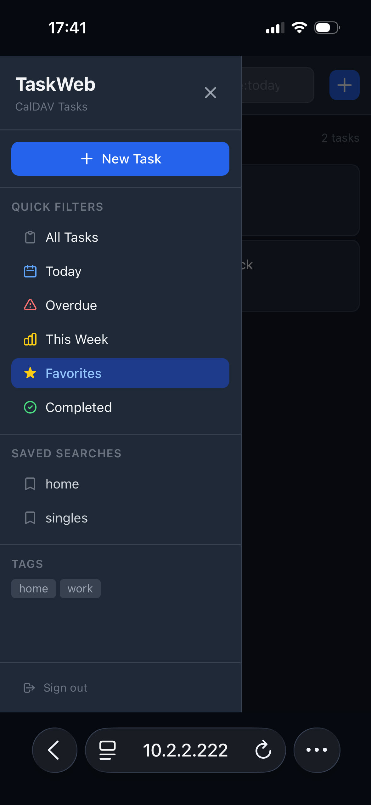

# taskweb_caldav

A web interface for CalDAV task servers, built with FastAPI + HTMX + Tailwind CSS.

## Screenshots



| Mobile task list | Mobile sidebar |
|---|---|
|  |  |

## Features

- View, create, edit, and delete tasks
- Due dates, priority (H/M/L), tags, recurrence (RRULE)
- Favourites (star button)
- Smart search: `+tag`, `-tag`, `due:today`, `due:overdue`, `priority:H`, `status:pending`, etc.
- Session-based login and static-token auth (`?token=` or `X-Auth-Token` header)

## Setup

```bash
python -m venv venv
source venv/bin/activate
pip install -r requirements.txt

cp .env.example .env
# Edit .env with your CalDAV credentials and auth settings
```

## Running (development)

```bash
source venv/bin/activate && python run.py
# → http://localhost:38000
```

## Deploying with Docker

```bash
# On the server
git clone https://github.com/bbrendon/taskweb_caldav.git /srv/taskweb_caldav
cd /srv/taskweb_caldav
cp .env.example .env && nano .env   # fill in credentials and secrets

docker compose up -d
# → http://<host>:38000
```

To update:

```bash
git pull && docker compose up -d --build
```

## Environment variables

| Variable               | Purpose                                            |
| ---------------------- | -------------------------------------------------- |
| `CALDAV_URL`           | CalDAV server base URL                             |
| `CALDAV_USERNAME`      | CalDAV username                                    |
| `CALDAV_PASSWORD`      | CalDAV password                                    |
| `CALDAV_CALENDAR_NAME` | Calendar name (default: `Tasks`)                   |
| `SESSION_SECRET`       | Signs the session cookie — use a random string     |
| `AUTH_PASSWORD`        | Login form password                                |
| `AUTH_TOKEN`           | Static token for `?token=` / `X-Auth-Token` access |

Generate secrets with:
```bash
python -c "import secrets; print(secrets.token_urlsafe(32))"
```
