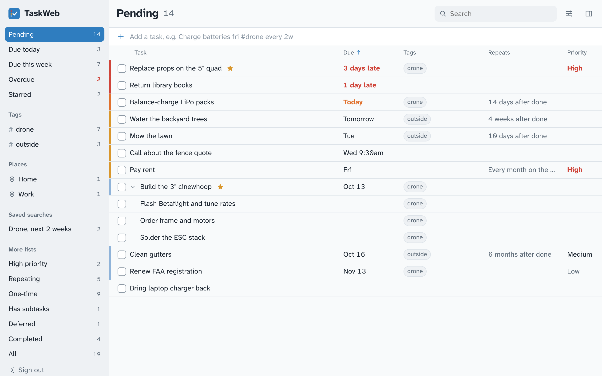
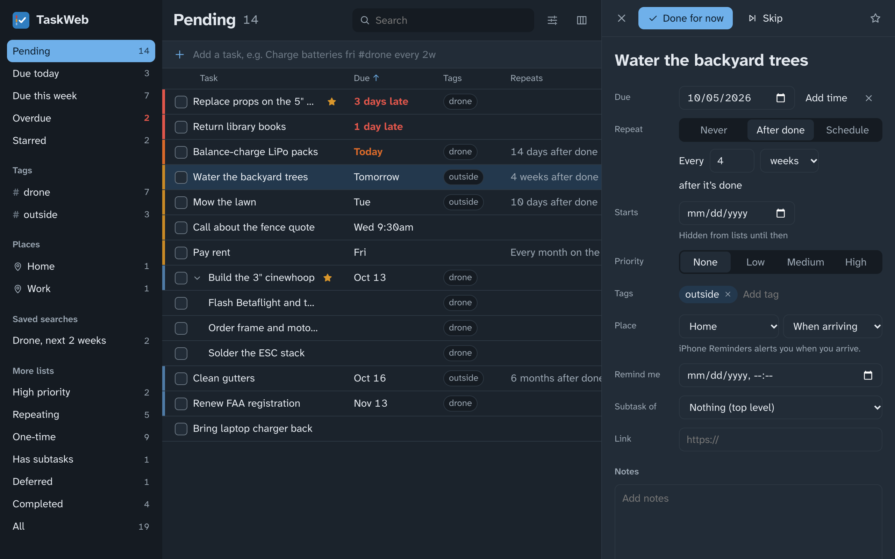
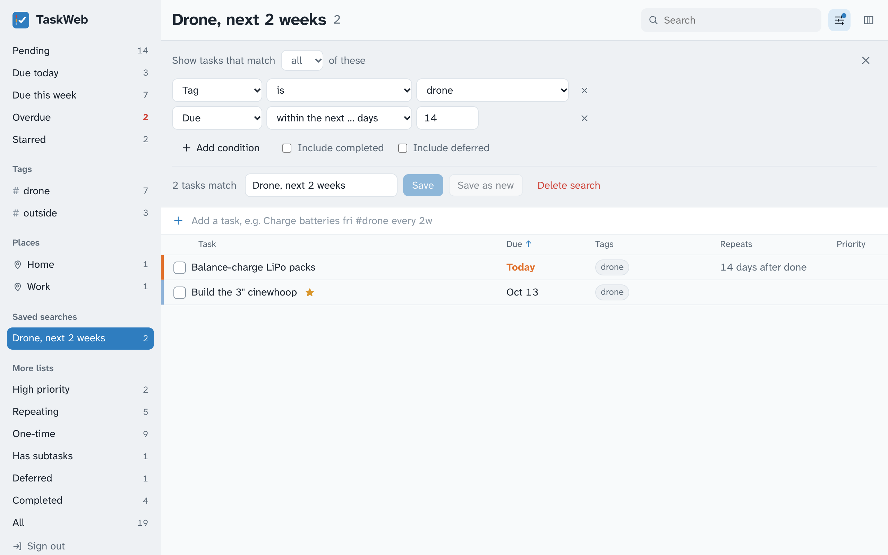
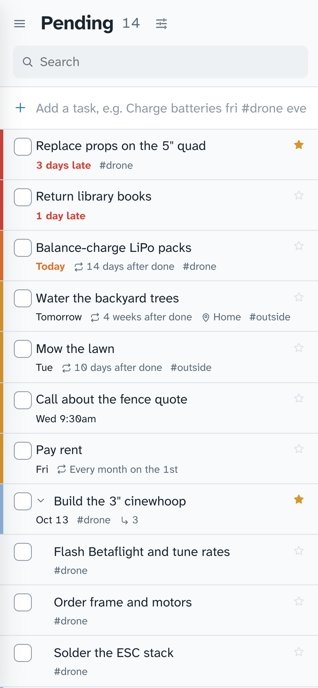
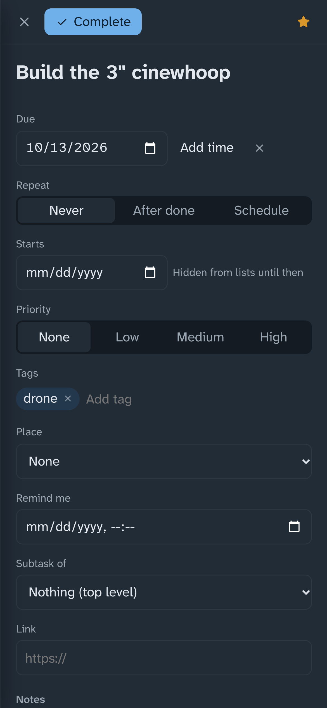

# TaskWeb

A personal task manager that keeps everything in a [Radicale](https://radicale.org) CalDAV
calendar. It runs as a home-screen web app on iPhone and as a normal web app on the desktop,
and the same tasks also sync to iPhone Reminders.

The main reason it exists: **tasks that repeat N days after you finish them**, not on a fixed
calendar. Water the trees every 4 weeks *after* the last watering. Fixed schedules
("1st of every other month") work too.



*Screenshots use sample data.*

## Features

- **Repeat after done** (every N days, weeks, months or years after completion) or on a fixed schedule.
  Completing a repeating task rolls the same task forward and logs the completion.
- **Smart lists:** pending, due today, due this week, overdue, starred, high priority, repeating,
  one-time, has subtasks, deferred, completed, all. Plus a list per tag and per place.
- **Saved searches:** build filters on text, tag, place, priority, due window, repeat type,
  starred and status, then save them to the sidebar.
- **Configurable columns** per list, sortable, with subtasks shown as a collapsible tree.
- **Urgency rail:** a colored strip down the list (late, today, this week, later).
- **Quick add:** `Charge goggles fri 6pm #drone !h every 2w @Home` sets the due date, time, tag,
  priority, repeat and place in one line.
- **Location alerts** (arrive or leave a preset place) and **timed reminders**, fired by iPhone
  Reminders.
- **Start dates** that hide a task until it is relevant, and **completion history** for repeating tasks.
- **Phone gestures:** swipe right to complete, left to star. **Desktop:** drag a task onto
  another to make it a subtask, plus keyboard shortcuts (`n` new, `/` search, `j`/`k` move,
  `x` complete, `s` star, `Enter` open).
- Light and dark mode, following the device.

| Editing a task (dark mode) | Saved search |
|---|---|
|  |  |

| iPhone list | iPhone editor |
|---|---|
|  |  |

## How it works

- **Backend:** FastAPI (Python 3.12), one process holding an in-memory index of the calendar,
  refreshed with WebDAV sync tokens. Writes are conditional (ETag `If-Match`), so an edit made
  on the phone in the meantime is never overwritten.
- **Frontend:** Vue 3 + TypeScript + Vite + Pinia, installable as a PWA.
- **CalDAV logic** lives in a separate library,
  [task-caldav-lib](https://github.com/bbrendon/task-caldav-lib) (branch `v0.2`).
- **Single user:** password-only login (argon2 hash), signed session cookie, login rate limit.

Data stays standard iCalendar (VTODO), so other CalDAV clients keep working. Notes on
compatibility:

- "Repeat after done" is stored as `X-TASKWEB-RECUR-AFTER:P30D`, not as an RRULE, so
  Reminders shows these as one-off reminders. If you check one off in Reminders, TaskWeb
  rolls it forward on its next sync.
- Radicale drops everything after an unescaped comma in Apple's location value, so the
  coordinates are written as `geo:lat\,lon`. iPhone reads that form correctly.
- Properties TaskWeb doesn't use (Apple and 2Do extensions) are kept intact on edit.

## Setup

Requirements: Python 3.12, Node 22+, a Radicale server with a task calendar, and Docker on
the machine that runs it.

```bash
uv venv --python 3.12 .venv
uv pip install --python .venv/bin/python -e ../task-caldav-lib -e 'backend[dev]'
(cd frontend && npm install)
cp .env.example .env                                  # CalDAV URL, user, password, calendar
cp config/taskweb.example.yaml config/taskweb.yaml    # time zone, tags, preset places
(cd backend && ../.venv/bin/python -m app.hashpw)     # prints APP_PASSWORD_HASH and SESSION_SECRET for .env
```

`task-caldav-lib` is expected next to this folder (`../task-caldav-lib`).

## Development

```bash
./scripts/dev.sh
```

This starts a throwaway Radicale with sample tasks, the API on :8000 and Vite on :5173
(password `taskweb-dev`). It never talks to your real server.

```bash
.venv/bin/python -m pytest backend/tests -q
(cd frontend && npx vue-tsc --noEmit && npm run build)
(cd frontend && npm run screenshots)                  # regenerate the README screenshots (needs dev.sh running)
```

## Deploy

```bash
./deploy.sh
```

Syncs the code and the library to the server with rsync, builds the Docker image and restarts
it on port 38000. The server's `.env` and `data/` (saved views) are never overwritten. Put it
behind HTTPS (the session cookie is `Secure`): iOS needs HTTPS for the home-screen app anyway.

## Maintenance scripts

All of these preview by default and only change the server with `--apply`.

| Script | What it does |
|---|---|
| `scripts/backup_calendar.py` | Read-only backup of every task to `backups/` |
| `scripts/archive_completed.py` | Save old completed tasks to `archive/` as `.ics` and `.csv`; `--remove` also deletes them |
| `scripts/purge_completed.py` | Delete old completed tasks without keeping them (takes a full backup first) |
| `scripts/migrate_repeats.py` | One-time conversion of old RRULE repeats to "after done" |
